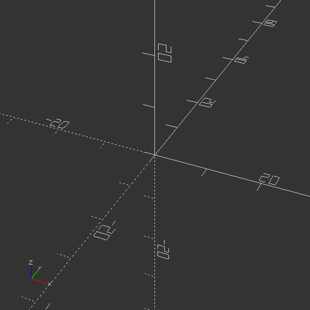
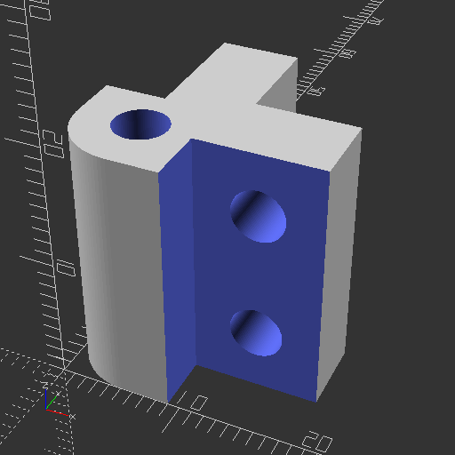
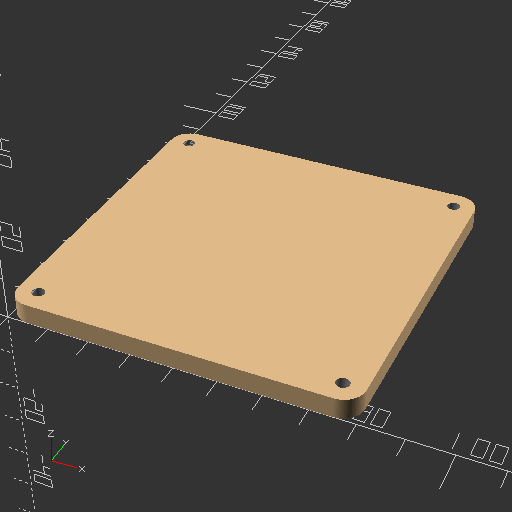
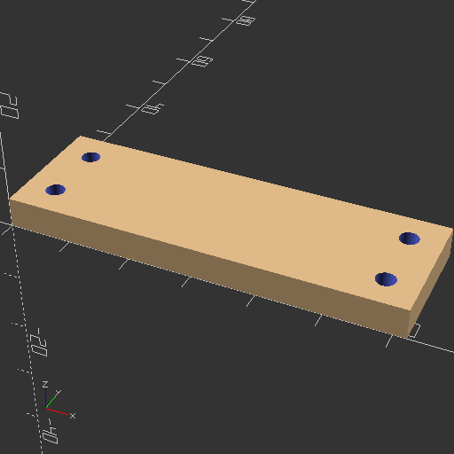
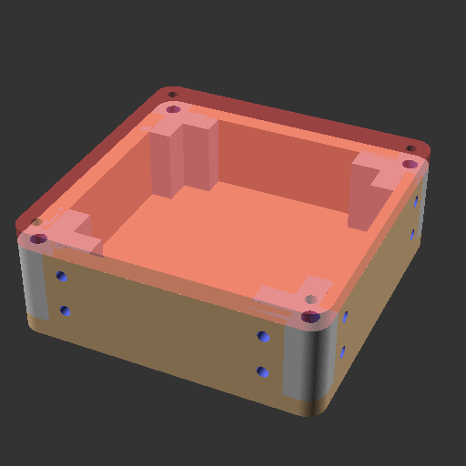

# Night Light 3D model

# Aperçu des rendus OpenSCAD

## Pièces

### crystalPiece


### facade-back


### facade-corner


### facade-front


### facade-left


### facade-top


## Composants

### housing-component


## Assemblage principal


```
.
├── components
│   └── housing-component.png
├── main.png
└── pieces
    ├── crystalPiece.png
    ├── facade-back.png
    ├── facade-corner.png
    ├── facade-front.png
    ├── facade-left.png
    └── facade-top.png
```

