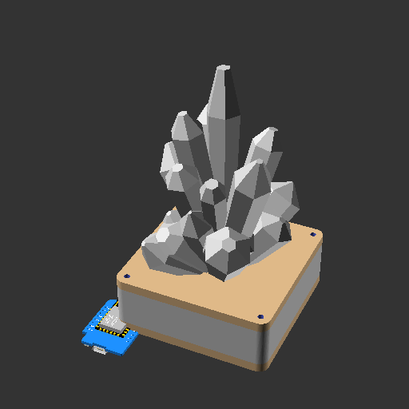
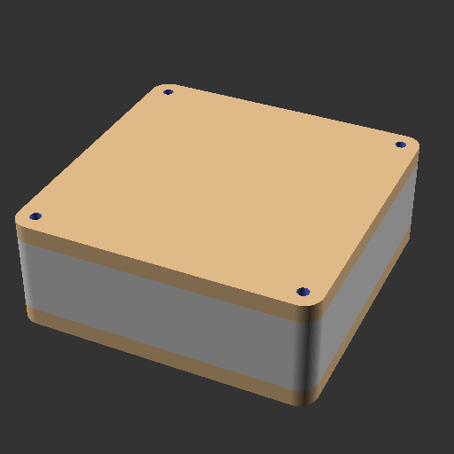
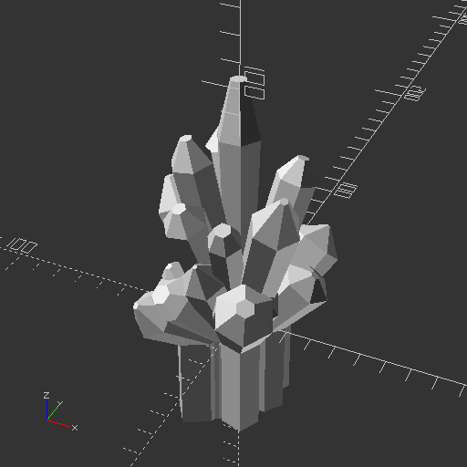
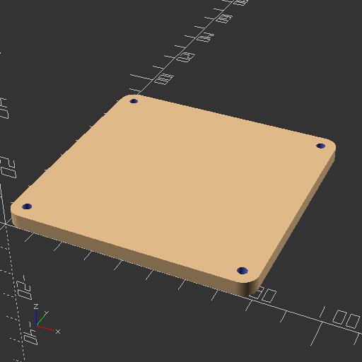
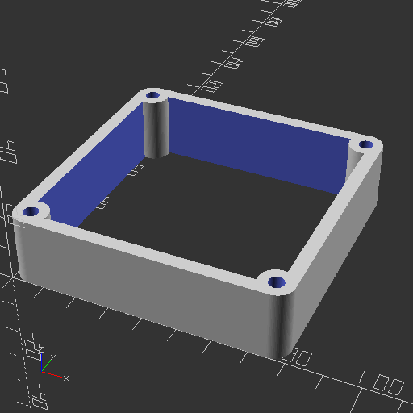

# Night Light 3D model
## Preview OpenSCAD renders

### Main

### Components

#### housingComponent

### Pieces

#### crystalPiece

#### facadeBottomPiece

#### facadeTopPiece

#### housingBorderPiece

